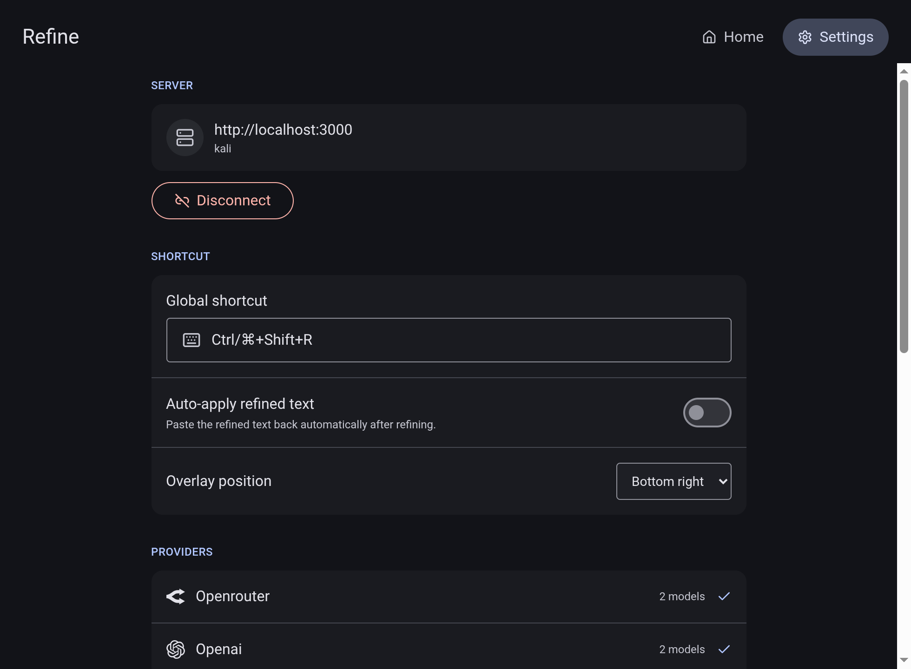
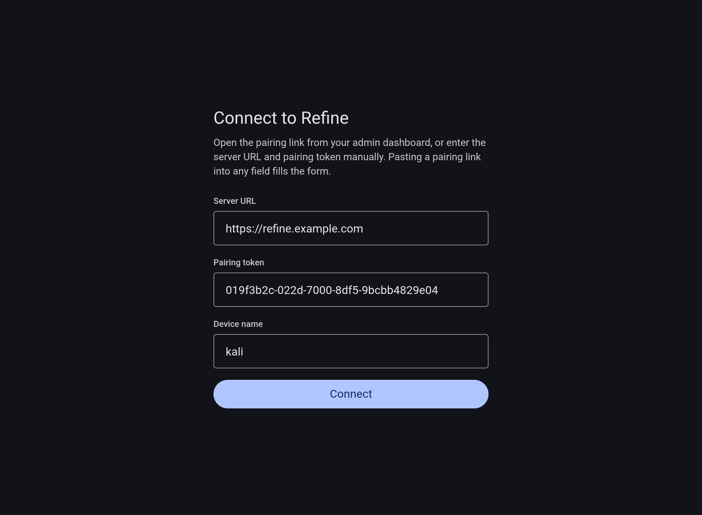
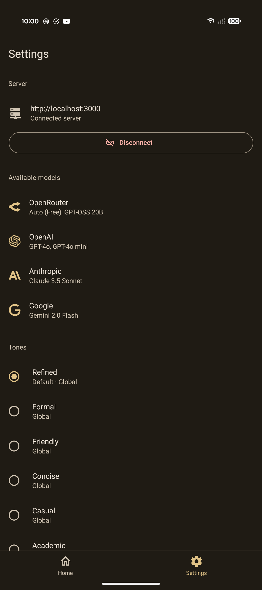
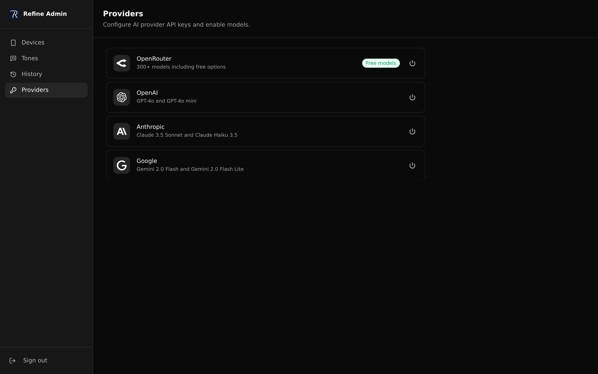
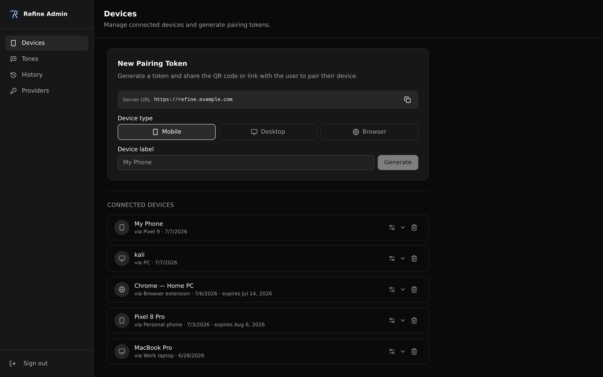
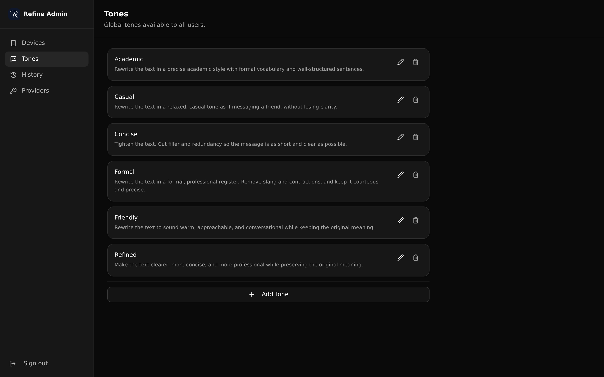

# Refine

An unintrusive, self-hosted text refinement tool. Select text anywhere — on your desktop or on Android — press **Refine**, and your text is rewritten by an LLM of your choice, in a tone of your choice, using your own API keys on your own server.

No subscriptions. No shared infrastructure. You control the models, the tones, and the keys.

**The pieces:**
- **API** — Hono server (Bun) that holds your provider credentials and handles refinements
- **Admin panel** — React SPA for managing providers, devices, and pairing tokens
- **Desktop app** — Windows/macOS/Linux (Electron). A global shortcut refines selected text in place, with a system tray for quick model/tone switching and a full window UI
- **Mobile app** — Android. Dedicated input surface plus a system context-menu action for refining selected text in-place

The server ships as a container image on GHCR (`ghcr.io/kyng-cytro/refine`); desktop installers and the Android APK are attached to each [GitHub release](https://github.com/kyng-cytro/refine/releases).

**[→ Self-Hosting Guide](GUIDE.md)**

---

## Screenshots

### Desktop app

| Home | Settings | Pairing |
|:---:|:---:|:---:|
|  |  |  |

### Mobile app (Android)

| Home | Settings | Pairing |
|:---:|:---:|:---:|
|  |  |  |

### Admin panel

| Providers | Devices |
|:---:|:---:|
|  |  |
| **Tones** | **History** |
|  |  |

---

## Monorepo

```
refine/
├── apps/
│   ├── api/        Hono HTTP API (Bun runtime)
│   ├── admin/      React SPA — provider & device management
│   ├── desktop/    Electron desktop app (Windows/macOS/Linux)
│   └── mobile/     Expo React Native app (Android only)
├── packages/
│   ├── db/         Drizzle ORM schema, migrations, seed
│   ├── models/     Provider/model catalog + icons
│   ├── schemas/    Zod types shared across API, admin, SDK, apps
│   └── sdk/        Typed API client used by mobile and desktop
```

**Tooling:** Bun, Turbo, TypeScript.

---

## Local development

```bash
bun install
bun run db:migrate && bun run db:seed
bun run dev
```

Copy `apps/api/.env.example` to `apps/api/.env` before running.

| Command | What it does |
|---|---|
| `bun run dev` | API + admin dev servers |
| `bun run api:dev` | API only |
| `bun run admin:dev` | Admin only |
| `bun run admin:build` | Production build (outputs to `apps/api/public/admin/`) |
| `bun run type-check` | TypeScript across all packages |
| `bun run db:generate` | Generate migration SQL from schema changes |
| `bun run db:migrate` | Run pending migrations |
| `bun run db:seed` | Seed default data |
| `bun run desktop:dev` | Electron desktop app in dev |
| `bun run desktop:dist` | Build desktop installers for the current OS |
| `bun run mobile:android` | Build and run Android app |
| `bun run mobile:prebuild` | Expo prebuild (generates native `android/`) |
| `bun changeset` | Add a changeset (run in every PR that changes a package) |

---

## Adding a provider

All provider definitions live in `packages/models/src/`. Admin and mobile consume them directly — three files to touch.

### 1. Type — `packages/models/src/types.ts`

```ts
export type ModelProvider = "openrouter" | "openai" | "anthropic" | "google" | "yourprovider"
```

### 2. Icon — `packages/models/src/icons/index.ts`

Icons come from `simple-icons`. Add the import and export it:

```ts
import { siYourprovider } from "simple-icons"

export const icons = {
  yourprovider: fromSi(siYourprovider),
}
```

If the provider isn't in `simple-icons`, inline the SVG as a string with `fill="currentColor"`.

### 3. Provider entry — `packages/models/src/index.ts`

```bash
bun add @ai-sdk/yourprovider --cwd packages/models
```

```ts
import { createYourProvider } from "@ai-sdk/yourprovider"

{
  id: "yourprovider",
  label: "Your Provider",
  description: "Short description shown in the admin panel",
  placeholder: "key-prefix…",
  docs: "https://yourprovider.com/api-keys",
  icon: icons.yourprovider,
  create: (apiKey) => createYourProvider({ apiKey }),
  models: [
    {
      id: "yourmodel-v1",
      label: "Your Model v1",
      icon: icons.yourprovider,
      cost: { input: 2.5, output: 10 },
    },
  ],
},
```

`cost` is the model's list price in USD per 1M tokens, used for the admin usage cost estimates. Use `{ input: 0, output: 0 }` for free models, or omit it when pricing is unknown (e.g. auto-routed models).

